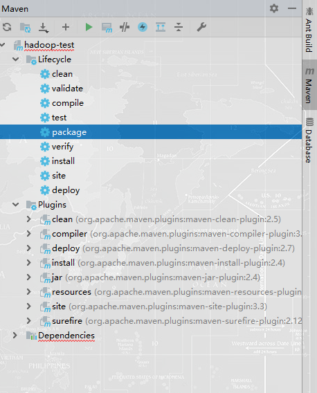

# 实验0：Hadoop安装与配置  
> 操作系统：Ubuntu 18.04 LTS x64，采用Windows 10下Linux子系统方式运行  
Hadoop版本：3.2.0  
JDK版本：11.0.2(LTS)  

## 1. Java环境安装
- 1.1 从Oracle官网获取JDK最新版的Linux版本下载地址，由于是Ubuntu，选择使用deb包，使用wget命令下载  
`wget http://download.oracle.com/otn-pub/java/jdk/11.0.2+9/f51449fcd52f4d52b93a989c5c56ed3c/jdk-11.0.2_linux-x64_bin.deb`  
  
- 1.2 使用dpkg命令安装  
`sudo dpkg -i jdk-11.0.2_linux-x64_bin.deb`  
默认安装在`/usr/lib/jvm/jdk-11.0.2`，这里我将`/usr/lib/jvm/jdk-latest`链接到该目录  
  
## 2. Hadoop安装  
- 2.1 从官网下载最新版本3.2.0  
`wget http://mirrors.tuna.tsinghua.edu.cn/apache/hadoop/common/hadoop-3.2.0/hadoop-3.2.0.tar.gz`  
  
- 2.2 解压安装  
`tar -zxvf hadoop-3.2.0.tar.gz -C /usr/local`  
- 2.3 Hadoop参数设置  
`vim sbin/core-site.xml`  
  
`vim sbin/hdfs-site.xml`  
  
## 3. 配置SSH
- 3.1 安装SSH
使用`sudo apt install openssh-server`安装
- 3.2 配置SSH开机自启动
使用`sudo update-rc.d ssh defaults`设置ssh服务自启动
- 3.3 生成公钥和私钥
`ssh-keygen`
- 3.4 将公钥写入authorized_keys
`cat id_rsa.pub >> authorized_keys`
注意：这里`authorized_keys`文件的权限需为644
- 3.5 使用`ssh localhost`测试连接

## 4. 启动Hadoop
- 4.1 配置环境
在`~/.bashrc`文件中配置JAVA与Hadoop的相关信息

- 4.2 测试
使用`hadoop version`测试

- 4.3 格式化dfs文件系统
`hdfs namenode -format`

- 4.4 启动Hadoop
`sbin/start-dfs.sh`
使用`jps`命令查看运行进程

若有以上四个JAVA进程则启动成功
## 4. Hadoop测试  
- 4.1 创建测试文件  
`mkdir ~/test`
`vim file1.txt`
`vim file2.txt`
- 4.2 将文件拷贝到Hadoop文件系统
`hdfs dfs -put ~/test /test-in`  
使用`hdfs dfs -ls -R /`查看文件

- 4.3 运行WordCount测试程序
该程序在`hadoop/share/hadoop/maoreduce/hadoop-mapreduce-examples-3.2.0,jar`  
`hadoop jar hadoop-mapreduce-examples-3.2.0,jar wordcount /test-in /test-out`

- 4.4 查看计算结果
`hdfs dfs -cat /test-out/part-r-00000`

## 5.Hadoop配置Web管理
在`hdfs-site.xml`加入如下配置
```xml
<property> 
    <name>dfs.http.address</name>
    <value>0.0.0.0:50070</value>
</property>
```
重启Hadoop，使用浏览器登录http://localhost:50070，界面如下

## 6.Intellij IDEA配置
- 6.1 Maven
由于Hadoop依赖众多，这里使用Maven配置项目依赖  
新建Maven项目  
在`pom.xml`文件中配置相关依赖项  
```xml
<dependencies>
        <dependency>
            <groupId>org.apache.hadoop</groupId>
            <artifactId>hadoop-common</artifactId>
            <version>3.2.0</version>
        </dependency>
        <dependency>
            <groupId>org.apache.hadoop</groupId>
            <artifactId>hadoop-mapreduce-client-core</artifactId>
            <version>3.2.0</version>
        </dependency>
    </dependencies>
```
以上两个依赖项可以满足示例程序`WordCount`的运行，更多的依赖项可以在[Maven Repository](https://mvnrepository.com/)
- 6.2 配置远程调试
在IDEA中配置远程文件  

在终端中设置`export HADOOP_CLIENT_OPTS="-agentlib:jdwp=transport=dt_socket,server=y,suspend=y,address=*:5005"`
- 6.3 配置远程部署
在设置中配置SFTP方式上传

- 6.4 编译项目
在`pom.xml`文件中配置主类
```xml
<build>
    <plugins>
        <plugin>
            <groupId>org.apache.maven.plugins</groupId>
            <artifactId>maven-jar-plugin</artifactId>
            <configuration>
                <archive>
                    <manifest>
                        <addClasspath>true</addClasspath>
                        <mainClass>WordCount</mainClass> <!-- 你的主类名 -->
                    </manifest>
                </archive>
            </configuration>
        </plugin>
    </plugins>
</build>
```
使用Maven的`package`工具生成jar包并上传

- 6.5 运行jar文件
`hadoop jar hadoop-test-1.0-SNAPSHOT.jar /test-in /test-out`
此时会等待IDEA开启远程调试，在IDEA中点击调试按钮即可开始远程调试
## 相关问题
#### 1. 出现22端口的拒绝访问
这个问题是由于SSH服务未开启或配置错误，一定要注意.ssh文件夹下相关文件的权限
#### 2. 某个Hadoop进程未启动
可查看`hadoop/log/`文件夹下相关日志文件信息，若出现security字样或tmp文件夹无法创建等，可能是hadoop文件夹的权限问题，使用`chown -R`和`chmod -R`将hadoop文件夹的所有者和权限进行修改
